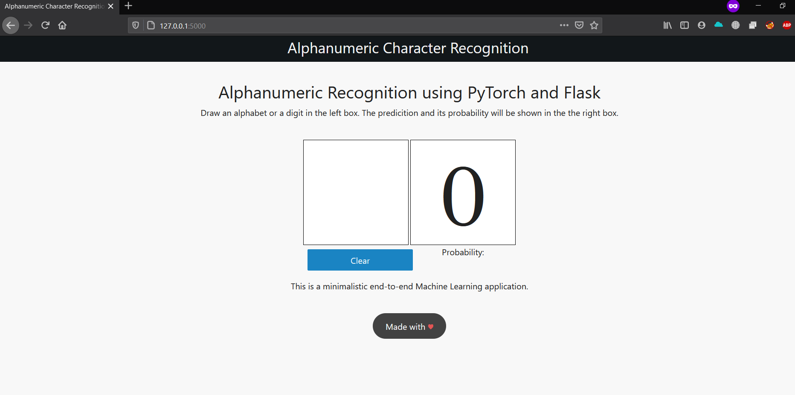
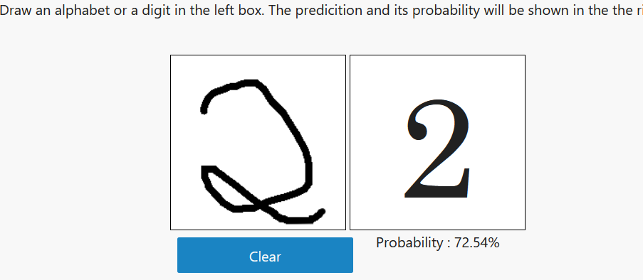
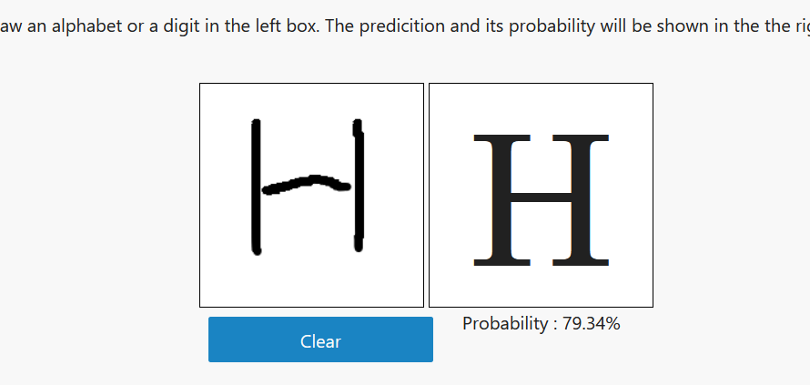

# Alphanumeric Recognition

[](https://github.com/ashish493/alphanumeric_recognition/issues)
   
<p align="center">
    
</p>
   
Aplhanumeric Recognition is a web application for detecting handwritten characters as well as digits, which is trained on the EMNIST dataset. 

**Installation**

1. Clone the Repo

  ```git clone https://github.com/ashish493/alphanumeric_recognition.git```

2. Install the dependecies

  ```pip install -r requirements.txt```

3. Run the flask server in the app directory

  ```python -m flask run```

> Note: We recommend installing the application in a [virtual environment](https://packaging.python.org/guides/installing-using-pip-and-virtual-environments/#installing-virtualenv) to prevent conflicts with other projects or packages.

If u want to train the [dataset](https://www.nist.gov/itl/products-and-services/emnist-dataset) yourself, then simply run

  ``` python cnn_train.py```

**Demo**

Because of the larger slug size, I was not able to host on Heroku. If anyone knows a better hosting site for deployent, u can simply create a issue.

```
-----> Discovering process types
       Procfile declares types -> (none)
-----> Compressing...
 !     Compiled slug size: 731M is too large (max is 500M).
 !     See: http://devcenter.heroku.com/articles/slug-size
 !     Push failed
```
Meanwhile, I have attached some screenshots of application, after running the server locally.



Outputs




**Deployment Options**

I have provided the ```Dockerfile``` in the [repo](https://github.com/ashish493/alphanumeric_recognition/blob/master/Dockerfile). U can manually build it to get the 'dockerimage' and then deploy it on the cloud or on your respective server. 

**How to Contribute**

Since this is a very new project, I would really love your input whether it's :- 
- Reporting a bug
- Discussing the current state of the code
- Submitting a fix
- Proposing new features
- PR from the To-Do section 

For bugs,discussions or propasing features, simply open/raise an Issue. 

For PR's of fixes or new features describe about the fix or feature and then add a screenshot of the working output. 

**To-Do/Future Improvements**
- Hyperparameter optimization 
- Neural network pruning 
- Displaying top-n predictions 
- Load balancer in a cluster 
- Add correction and submit options 
- Improving the frontend web design


**Acknowledgements**

- My model is based on [this](https://github.com/Giffy/AI_EMNIST-character-recognition/blob/master/EMNIST_byClass_GPU_.ipynb) notebook.

- I took the logo from [this](https://omar-quiambao.squarespace.com/identity/fkjm6v8od4iekqn9hajd07vxtxuzwp) website.

